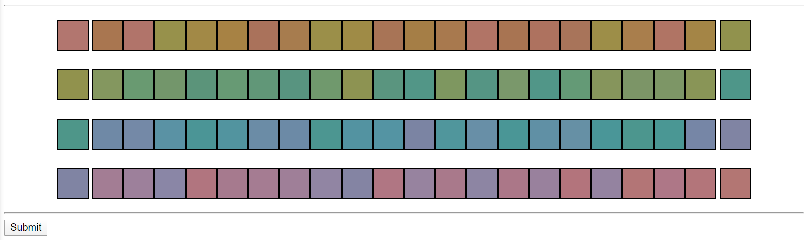

# Farnsworth-Munsell 100 Hue Color Vision Test in javascript

Implementation of the Farnsworth-Munsell 100 Hue Color Vision Test in javascript.
Colour patches from X-Rite (https://www.xrite.com/hue-test).
Uses sortable.js for block dynamics (https://github.com/SortableJS/Sortable)

Note: For educational purposes only. Should not be used as a substitute for an in-person FM100 test.
